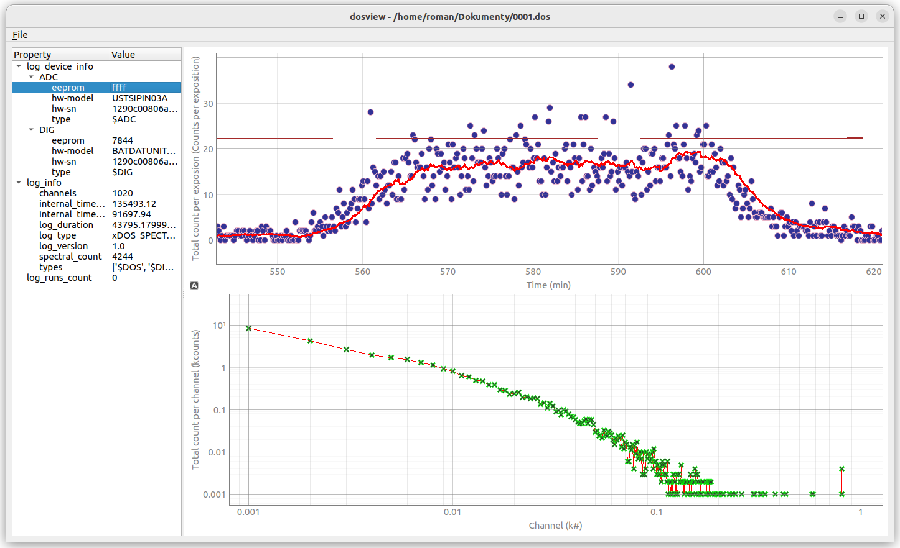

# Dosview

## Overview
**Dosview** is a lightweight, efficient log viewer written in Python3, utilizing the Qt framework for its graphical interface. It is designed to facilitate quick viewing and analysis of [UST's radiation detectors](https://docs.dos.ust.cz/) log files directly from the command line.




## Features
- **Command Line Interface**: Start viewing logs with a simple command.
- **Fast Performance**: Optimized for quick loading and smooth scrolling through large log files.
- **Cross-Platform Compatibility**: Works on any platform that supports Python and Qt.
- **Callable from gui**: Dosimeter file can be opened from graphical file browser. 

## Installation
Dosview can be installed using several methods. Below are the instructions for each:

### From [PyPI](https://pypi.org/project/dosview/) Repositories
1. Simply run the following command:
   ```
   sudo pip3 install dosview
   ```

### From GitHub Repository Using pip
1. Ensure you have pip installed on your system.
2. Run the following command to install directly from GitHub:
   ```
   sudo pip3 install git+https://github.com/UniversalScientificTechnologies/dosview.git
   ```

### From local repository clone using pip
1. solve requirements from previous instructions
2. Clone your repository 
```
  git clone git://github.com:UniversalScientificTechnologies/dosview.git
  cd dosview
  sudo pip3 install -e . 
```

### Desktop menu entry (Linux, optional)

`pip install` does not register dosview in the desktop application menu,
since that means writing outside the Python environment
(`/usr/local/share/...`). To add a menu entry and icon after installing:
```
sudo ./tools/install_desktop_entry.sh
```

## Usage
To use dosview, open your command line interface and execute the following command:

```
dosview <filename>
```

Replace `<filename>` with the path to the log file you wish to view.


## Configuration
Dosview does not require additional configuration. It is ready to use immediately after installation.
